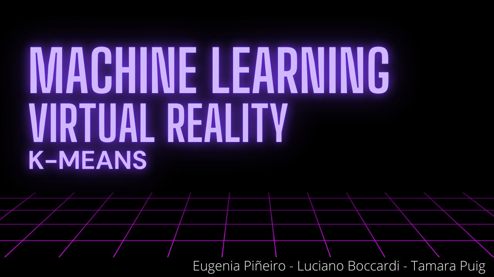

# Machine Learning VR



## Description
We developed a visualization in Virtual Reality of the K-Means method. It is an unsupervised Machine Learning algorithm that allows partitioning a set of observations into k clusters.

Each cluster has associated a color and a synthesizer note so it will help you to distinguish them from each other. You will also get information if you are viewing overlapping clusters as multiple audios will be heard at once, and in case one object is hidden by another it will help you realize that there is another point at that position. Each cluster is represented as an object that contains all its points, so it is not necessary to look particularly at a single point to hear the sound, but in the direction where the cluster is located.

You can also see how clusters change over time, allowing you to notice the progression of the algorithm.

See trailer [here](https://youtu.be/rBi8RNrcMoI)
## Usage 

The program receives as input a JSON file `Assets/Input/config.json` to customize the experience.  

| Parameter | Description                    | Value|
| ------------- | ------------------------------ | ------------- |
|"K"     |  Numbers of clusters for K-Means algorithm | int |
|"CsvPath"     | Path to dataset in .csv format  | string |
|"ParticleSystem"   | Use particle systems implementation to visualize plot or render points as quads to improve performace | boolean | 


## Plot Interaction
To improve experience you can move the plot around the dome.

- W: Move forward
- A: Move left 
- S: Move backward
- D: Move right
- Q: Move Up
- E: Move Down 
- F: Scale to make plot smaller
- R: Scale to make plot bigger
- Arrow Keys: Rotate plot 


## Examples 


```json
{
    "K": 4,
    "CsvPath": "Assets/Input/points.csv",
    "ParticleSystem": false
}
```


```json
{
    "K": 10,
    "CsvPath": "Assets/Input/points_big.csv",
    "ParticleSystem": false
}
```


